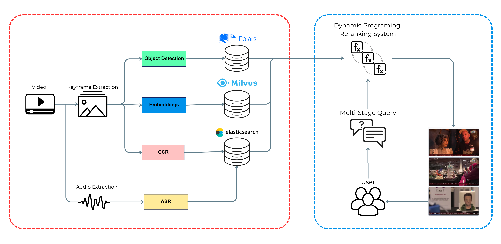
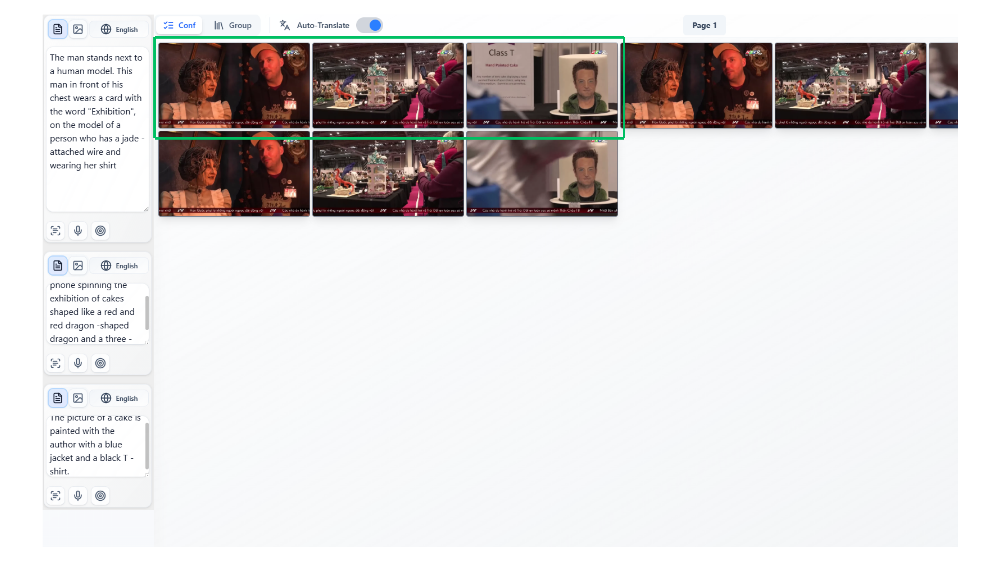

# BUCCI_GANG Team System

  

This tool matches keyframes to scenes based on text descriptions and context image. 

## Features

- CLIP & BEiT3 retrieval: Use OpenCLIP and BEiT3 models to find the most likely objects based on text descriptions.

- OCR & ASR: Extract on-screen text and spoken words from video keyframes using their timestamps.

- Object detection: Apply D-FINE and Co-DeTR to detect common (COCO) objects in keyframes.

- Weighted fusion: Combine and re-rank detection results by balancing feature scores within each keyframe.

- Search algorithm: Use a temporal model and dynamic programming to re-rank all keyframes across time for better overall accuracy.

## Demo

  

## Directory Structure

| Argument | Description | 
|----------|-------------|
| `api` | Backend API for System |
| `others folder` | Directory containing code for extract features and testing algorithms | 

